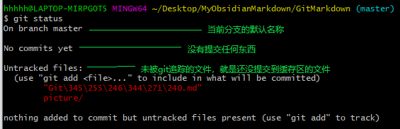
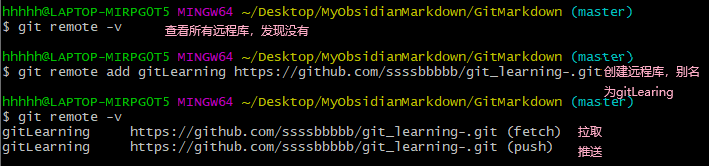

## 一、Git简介
Git是开源的分布式版本控制系统。

### 1.1 什么是版本控制系统
版本控制是一种记录一个或若干文件内容变化，以便将来查阅特定版本修订情况的系统。

### 1.2 版本控制系统能用来干什么
**它可以用来管理不同版本的文件**，比如：
在工作中，有份文档要写，不过你得按照组长的思路与建议写。突然写到一半在你的脑海里出现了一个很妙的点子，但是这个点子却跟组长的思路不同。现在就有两个问题摆在了你面前：  
1. 你想把自己的点子写下来，但这与当初和组长商讨的内容不同，如果自己的点子boss看不上，并且让他知道了是你擅自更改的，就会被处罚。
2. 如果把自己的点子写下来，再重做一份与组长思路相符合的文档，但这样时间不够。

现在该怎样解决这个问题呢？  
版本控制系统就是最好的解决方式。

你使用Git可以将当前写到一半的文档保存快照为file1，Git会以某种方式储存在库里，现在你就该写应付组长的那份文档了完成后使用Git将其保存快照为file2。现在自己就可以大展宏图了，不过这时不需要重新写一份自己思路来之前的前半段的文档，只需要使用Git调用file1的快照，在file1的内容上添加自己的思路即可，而完成后的文档会被保存为file3.


至此，你手上就有三份文件了，file1（最原始的文档版本），file2（组长思路的版本），file3（自己思路的版本）。现在你只需要将拥有自己思路的版本交给boss看，如果他并不满意你的思路，那么你只需要使用简单的Git命令把file3退回到file2的内容，然后再把file2交给boss即可。

不仅如此，**版本控制系统还可以记录文件的修改历史，从而让用户能够查看历史版本**。紧接上文，boss觉得你这次提交上来的方案很不错，很新颖，但他发现这个文档的思路貌似不是组长的。于是boss也打开了Git，而且boss还是管理员，他查看了一下你的用户下对该文档的更改历史记录，发现那个文档竟然有三个版本。当他把这三个版本的文档都看了一边后就知道了，刚刚那份很棒的文档是你用自己的思路写出来的，于是boss打算重用你，而你也因此升职加薪，可喜可贺。  ^01bd20

### 1.3 为什么要使用版本控制系统
从个人开发过度到团队协作。

比如：[[Git学习#^01bd20|上文]]中，组长知道了你因为更改了他的思路而得到了boss的嘉奖，组长很不服。于是他也打开了Git，调出了file2，然后将自己的思想和一些奇妙的经验添加进去并做修改，保存快照为file4，然后发给boss。当boss看到后突发奇想，将组长的文档前半段跟你的文档后半段合并在一起并稍作修改，保存快照为file5。将file5交给客户后，客户大为满意，非常乐意按照file5上的方案进行项目，于是乎，该项目文档的最终文档定为了file5。

### 1.4 Git工作机制


## 二、Git常用命令
|命令名称|作用|
|---|---|
|git config --global user.name 用户名|设置用户签名|
|git config --global user.emal 邮箱| 设置用户签名|
|git init|初始化本地库|
|git status|查看本地库状态|
|git add 文件名|添加到暂存区|
|git commit -m "日志信息" 文件名|提交到本地库|
|git reflog、git log|查看历史记录|
|git reset --hard 版本号|版本穿梭|

### 2.1 设置用户签名
签名的作用是区分不同的操作者身份。Git首次安装必须设置用户签名，否则无法提交代码。
>注意：这里设置用户签名和将来登陆代码托管中心的账号没有任何关系。

```bash
hhhhh@LAPTOP-MIRPG0T5 MINGW64 ~/Desktop
$ git config --global user.name hjj

hhhhh@LAPTOP-MIRPG0T5 MINGW64 ~/Desktop
$ git config --global user.email 2512@qq.com
```
以上例子就是将用户设置为了hjj，用户的电子邮箱设置为了2512@qq.com。如果想要验证是否设置成功，就可以来到家目录下，当前使用用户的目录下有一个`.gitconfig`文件，设置的账号和邮箱就在里面。

### 2.2 初始化本地库
首先来到需要使用版本控制的目录，然后在gitBash的命令行里输入**git init**，随即该目录下就会生成一个名为`.git`的隐藏文件目录


### 2.3 查看本地库状态
在本地库初始化成功后就可以查看当前本地库的状态了，使用命令**git status**。


如果是还未添加到暂存区的文件，在工作区被更改了也不会有历史版本的记录，所以，在使用Git版本控制系统前要将需要被git追踪的文件上传到暂存区。

### 2.4 添加到暂存区
如果在工作区里有文件需要被git追踪，那么可以使用命令**git add 文件名**将其添加到暂存区。但是注意，添加到暂存区并不意味着它就能够生成历史版本。

操作如下图，先创建一个test.txt文件，然后将它添加到暂存区：

将test.txt文件添加到暂存区后可以看到该文件变成了绿色，与没有添加到暂存区的`.md`[^1]文件和`picture/`目录不同颜色。

### 2.5 提交本地库
将暂存区里的文件提交到本地库，然后形成历史版本，使用命令**git commit -m "日志信息" 文件名**。


在这之后可以使用**git reflog**、**git log**查看历史记录：

git reflog：查看的是详细版本号前七位  
git log：查看的是详细版本号

### 2.6 版本控制
现在，本地库里已经上传过一次test.txt文件了，它的内容是这样的：
```text
aaaaaaaaaaa
bbbbbbbbbbb
ccccccccccc
```

而后，需要修改该文件，将其内容修改该为：
```text
aaaaaaaaaaa
bbbbbbbbbbb
ccccccccccc
ddddddddddd
```

完成修改操作后查看git状态可以看见test.txt又变成红色了：


因此需要再将其提交到暂存区一次，然后上传本地库形成第二个版本：


### 2.7 版本穿梭
如果觉得当前版本的文件没有上个版本的文件好，那么就可以使用命令**git reset --hard 版本号**将指针指向对应版本号的文件。


可以来到工作区的目录下查看该文件，可以发现的的确确内容变成了之前第一个版本的样子。

## 三、git分支操作
相当于多个线程操作各自的副本，譬如一个软件，它当前的版本0在master分支上，这是第一个上线的版本，是给客户使用的。  
有一天，这个版本0需要更新，添加一些功能进去，于是就创建了一个分支a，而在master分支上的软件并不会受到a分支的影响，相当于是将版本0的软件拷贝到另一台电脑上进行代码修改，而在服务器上运行的版本0是一直保持不变的。  
当分支a修改完后，就上传到master分支上，形成版本1，而在客户更新后使用的软件就是版本1的了。
|命令名称|作用|
|...|...|
|git branch 分支名|创建分支|
|git branch -v|查看分支|
|git checkout 分支名|切换分支|
|git merge 分支名|把指定的分支合并到当前指针指向的分支上|

### 3.1 合并分支
使用test分支，对test.txt文件添加内容，然后切换到master分支将test分支更改后的test.txt合并到主分支里。

```Linux
hhhhh@LAPTOP-MIRPG0T5 MINGW64 ~/Desktop/MyObsidianMarkdown/GitMarkdown (master)
$ git branch test				//创建分支test

hhhhh@LAPTOP-MIRPG0T5 MINGW64 ~/Desktop/MyObsidianMarkdown/GitMarkdown (master)
$ git branch -v					//查看所有分支
* master 6fbfce1 This is test file
  test   6fbfce1 This is test file

hhhhh@LAPTOP-MIRPG0T5 MINGW64 ~/Desktop/MyObsidianMarkdown/GitMarkdown (master)
$ git checkout test				//将指针指向test分支
Switched to branch 'test'

hhhhh@LAPTOP-MIRPG0T5 MINGW64 ~/Desktop/MyObsidianMarkdown/GitMarkdown (test)
$ vim test.txt					//在test分支下编辑test.txt

hhhhh@LAPTOP-MIRPG0T5 MINGW64 ~/Desktop/MyObsidianMarkdown/GitMarkdown (test)
$ cat test.txt					//编辑的内容如下
aaaaaaaaaaa
bbbbbbbbbbb
ccccccccccc
11111111111
22222222222
33333333333

hhhhh@LAPTOP-MIRPG0T5 MINGW64 ~/Desktop/MyObsidianMarkdown/GitMarkdown (test)
$ git status					//查看test分支的本地库状态
On branch test
Changes not staged for commit:
  (use "git add <file>..." to update what will be committed)
  (use "git restore <file>..." to discard changes in working directory)
        modified:   test.txt

Untracked files:
  (use "git add <file>..." to include in what will be committed)
        "Git\345\255\246\344\271\240.md"
        picture/

no changes added to commit (use "git add" and/or "git commit -a")

hhhhh@LAPTOP-MIRPG0T5 MINGW64 ~/Desktop/MyObsidianMarkdown/GitMarkdown (test)
$ git add test.txt				//将test.txt添加到暂存区

hhhhh@LAPTOP-MIRPG0T5 MINGW64 ~/Desktop/MyObsidianMarkdown/GitMarkdown (test)
$ git commit -m "The 'test' branch is modified" test.txt		//上传本地库
[test bcbfd22] The 'test' branch is modified
 1 file changed, 3 insertions(+), 1 deletion(-)

hhhhh@LAPTOP-MIRPG0T5 MINGW64 ~/Desktop/MyObsidianMarkdown/GitMarkdown (test)
$ git checkout master			//将指针指向master主分支
Switched to branch 'master'

hhhhh@LAPTOP-MIRPG0T5 MINGW64 ~/Desktop/MyObsidianMarkdown/GitMarkdown (master)
$ cat test.txt					//查看master分支的test.txt内容（发现没有被test更改）
aaaaaaaaaaa
bbbbbbbbbbb
ccccccccccc

hhhhh@LAPTOP-MIRPG0T5 MINGW64 ~/Desktop/MyObsidianMarkdown/GitMarkdown (master)
$ git merge test				//将test分支合并到当前分支
Updating 6fbfce1..bcbfd22
Fast-forward
 test.txt | 4 +++-
 1 file changed, 3 insertions(+), 1 deletion(-)

hhhhh@LAPTOP-MIRPG0T5 MINGW64 ~/Desktop/MyObsidianMarkdown/GitMarkdown (master)
$ cat test.txt			//查看test.txt内容，发现在test分支内添加的内容合并到了主分支里
aaaaaaaaaaa
bbbbbbbbbbb
ccccccccccc
11111111111
22222222222
33333333333
```

### 3.2 冲突合并
冲突合并是指，两个分支在同一个地方进行不同的操作，git无法判断应该添加那个分支的修改内容，因此需要该分支使用者手动合并。
> 如果只是删除行内容和添加行内容是不会发生冲突合并的，除非是对单行内容做出了不同的修改。

==git是根据行管理的。==

操作如下：
1. 首先在master分支里创建新的文件 hello.txt，写入如下内容：
	```text
	hello world!
	111111111111
	```
	接着再将该文件加载到暂存区，然后再上传到本地库。所以，在master分支里hello.txt的内容就是如上。

2. 再是切换到test分支里，编辑 hello.txt，将其内容更改为以下内容：
	```text
	hello world!
	222222222222
	```
	再然后就是加载到暂存区，最后上传到本地库。所以，在test分支里hello.txt的内容就是如上。
	
3. 在test分支内，将master分支合并到一起，然后就会报错：
	```text
	hhhhh@LAPTOP-MIRPG0T5 MINGW64 ~/Desktop/MyObsidianMarkdown/GitMarkdown (master)
	$ git merge test
	Auto-merging hello.txt
	CONFLICT (content): Merge conflict in hello.txt
	Automatic merge failed; fix conflicts and then commit the result.
	```
	
	查看hello.txt的内容，发现变成这样了，需要手动修改的内容就在<<<<与>>>>之间:
	```text
	hhhhh@LAPTOP-MIRPG0T5 MINGW64 ~/Desktop/MyObsidianMarkdown/GitMarkdown 		(master|MERGING)
	$ cat hello.txt
	hello world!
	<<<<<<< HEAD
	11111111111
		=======
	222222222222
	>>>>>>> test
	```

4. 手动修改后，最终将内容定为了：
	```text
	hello world!
	11111111111
	222222222222
	```
	
5. 然后使用查看本地库状态可以看见，修改完后还需要再走一边加载暂存区和上传本地库的操作：
	
	
6. 注意，在加载到暂存区后，如果要上传到本地库，就不能再显示的调用被修改的文件名了：
	
	
	
## 四、远程仓库操作
|命令名称|作用|
|---|---|
|git remote -v|查看当前所有远程地址别名|
|git remote add 别名 远程地址|创建别名|
|git push 别名 分支|推送本地分支上的内容到远程仓库|
|git clone 远程地址|将远程仓库的内容克隆到本地|
|git pull 远程库地址别名 远程分支名|将远程仓库对于分支最新内容拉取下来后与当前本地分支直接合并|

### 4.1 创建远程仓库别名
https://github.com/ssssbbbbb/git_learning-.git  


### 4.2 推送本地库到远程库
语法：**git push 别名or地址 分支**


如果想知道到底哪些文件被git追踪了，可以先查看当前目录的所有文件，然后再查看git状态，就知道哪些文件是可以被推送的，哪些文件是还没git追踪的，需要加载暂存区然后上传本地库的：


### 4.3 拉取远程仓库到本地库
就是让本地库的文件与远程库的文件同步，命令是：  
**git pull 远程库地址别名 远程分支名**

1. 先在GitHub上新建了文件，gitHubTest.py，然后要同步本地库与Github的文件：
	
	

### 4.4 克隆远程库到本地库
就是将远程库中的内容复制到本地库，使用命令：**git clone 远程地址**

这里用来做示例：  
https://github.com/ssssbbbbb/Study_the_warehouse.git

总是克隆失败，算了。

### 4.5 邀请加入团队
开源的项目对于其它人只有阅读的权限，普通人开源将代码下载下来阅读并在本地做修改，但是普通人是无法对改项目的远程库进行推送的，必须要被那个项目的管理员邀请才能有修改远程仓库的权限。


发起邀请后，被邀请人的GitHub里就会接到被邀请信息，只要同意了就可以对改项目的远程库进行推送操作。

[^1]:因为这个文件我是以中文命名的，所以出现了乱码，因此我以.md文件代替该文件名。
